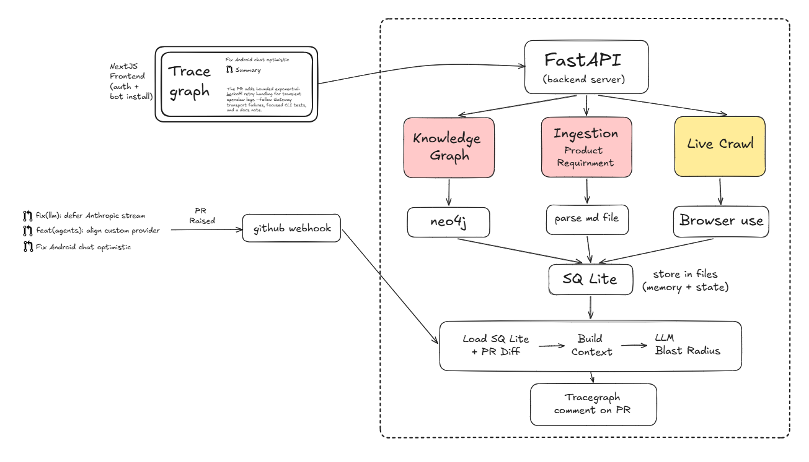
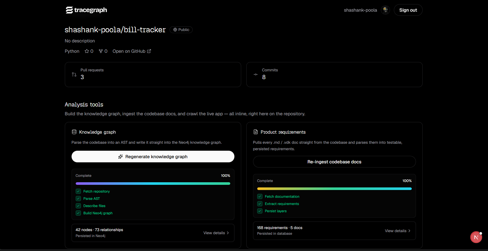
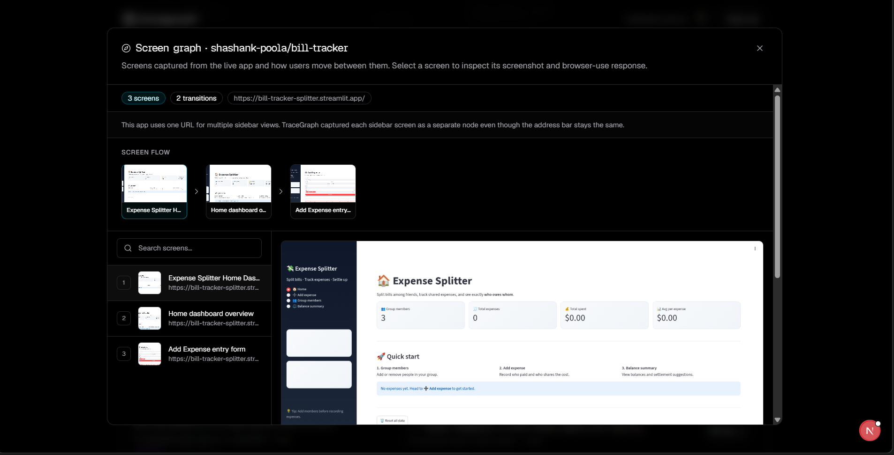

# TraceGraph

TraceGraph builds three linked views of a software product — **code**, **UI**, and **requirements** — then uses them to explain the blast radius of a pull request in plain language.

It is a FastAPI + Next.js app: you connect a GitHub repo, run analyze / crawl / ingest once, and a GitHub App comments on PRs with what changed, which screens are at risk, and which requirements may lose coverage.

---

# Architecture



# Why We Built This

Code review tools are good at diffs. They are weak at answering the question a QA lead actually asks: *what product behavior does this PR touch?*

Static analysis sees functions. E2E suites see clicks. Specs live in markdown nobody re-reads. Those layers rarely meet in one place, so reviewers guess.

We started with AST → Neo4j for the code layer. That answered “what calls what,” but not “what screen breaks” or “which requirement is uncovered.” So we added a live UI crawl (browser-use) and a requirements ingest from repo docs. PR review became a single LLM pass over all three layers plus the diff.

Trade-off we accepted: the system is strongest when you have run all three pipelines for a repo. Without crawl or ingest, the bot still reviews from code + diff — thinner, but still useful. We chose fire-and-forget background jobs over a worker queue so local setup stays two processes (API + frontend), not Redis/Celery.

---

**Frontend** — dashboard, job progress, screen graph, PR list. Auth is cookie-based against the API; no separate BFF.

**Backend** — thin HTTP routes; work lives in `services/`. Jobs update an in-memory store for live polling and persist completed artifacts to SQLite.

**GitHub App** — separate from OAuth login. OAuth reads the user’s repos; the App posts PR comments and receives webhooks.

**Three layers**

| Layer | Produced by | Stored as |
|-------|-------------|-----------|
| Code | `/analyze` → AST + LLM descriptions → optional Neo4j | `repo_trees` |
| UI | `/crawl` → browser-use per route (+ sidebar views) | `crawl_results` |
| Requirements | `/ingest` → markdown/docs → structured requirements | `ingest_results` |

PR review loads the newest artifacts for the repo (webhook has no user session) and posts one upserted comment marked with `<!-- tracegraph:begin -->`.

---

# How It Works

1. **Sign in** with GitHub OAuth. Install the GitHub App on the repos you care about.
2. **Open a repo** in the dashboard. Optionally pin it with Track (favorites only — not the same as App install).
3. **Generate knowledge graph** — downloads the tarball, parses Python AST, describes files with an LLM, writes Neo4j when configured.
4. **Ingest docs** — pulls `.md` / `.vdk` from the repo and extracts requirements.
5. **Crawl the live app** — you supply a base URL and routes; browser-use captures screenshots and labels. Streamlit-style sidebars are expanded automatically.
6. **Open a PR** — webhook `pull_request` (opened / synchronize / …) starts a reason job. Expect ~1–3 minutes before the bot comment appears (LLM-bound). Closing a PR is ignored on purpose.

Manual trigger: `POST /reason` with `{ "full_name", "pr_number" }`.

Local webhooks: point the App at a smee.io URL and forward to `http://localhost:8000/webhook/github`. Subscribe the App to **Pull request** events — permissions alone are not enough.

---

# Tech Stack

- **Backend:** Python 3.11+, FastAPI, SQLite, Neo4j (optional), browser-use SDK, httpx
- **Frontend:** Next.js 16 (App Router), React 19, Tailwind 4
- **Integrations:** GitHub OAuth + GitHub App, LLM providers (GLM → Groq → Gemini fallback)

---

# Running Locally

**Backend**

```bash
cd backend
cp .env.example .env   # fill OAuth, App, LLM, optional Neo4j + BROWSER_USE_API_KEY
uv sync
uv run uvicorn src.main:app --reload --port 8000
```

**Frontend**

```bash
cd frontend
# NEXT_PUBLIC_API_URL=http://localhost:8000
bun install   # or npm / pnpm
bun run dev   # http://localhost:3000
```

**Webhook (optional)**

```bash
npx smee-client --url <your-smee-url> --target http://localhost:8000/webhook/github
```

OAuth callback should match `GITHUB_OAUTH_CALLBACK_URL` (default `http://localhost:8000/auth/github/callback`). App Setup URL: `http://localhost:3000/install/complete`.

---

## Live Preview(TraceGraph Dashboard)




# Future Improvements

- Durable job queue (survive API restarts; today live progress is in-memory)
- Structured crawl auth without putting passwords in agent prompts
- Shared auth context on the frontend (fewer duplicate `/auth/me` calls)
- Split `storage.py` by domain once the schema stabilizes

---

# Contributing

Keep changes small and explainable. Prefer deleting dead paths over adding flags. If a founder asks “why does this exist?”, the answer should be obvious from the code or this README.
