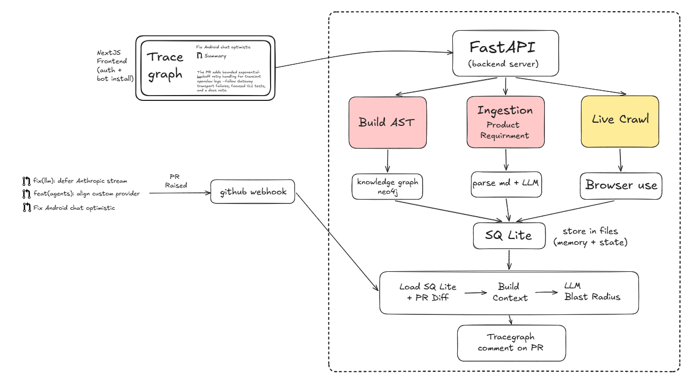
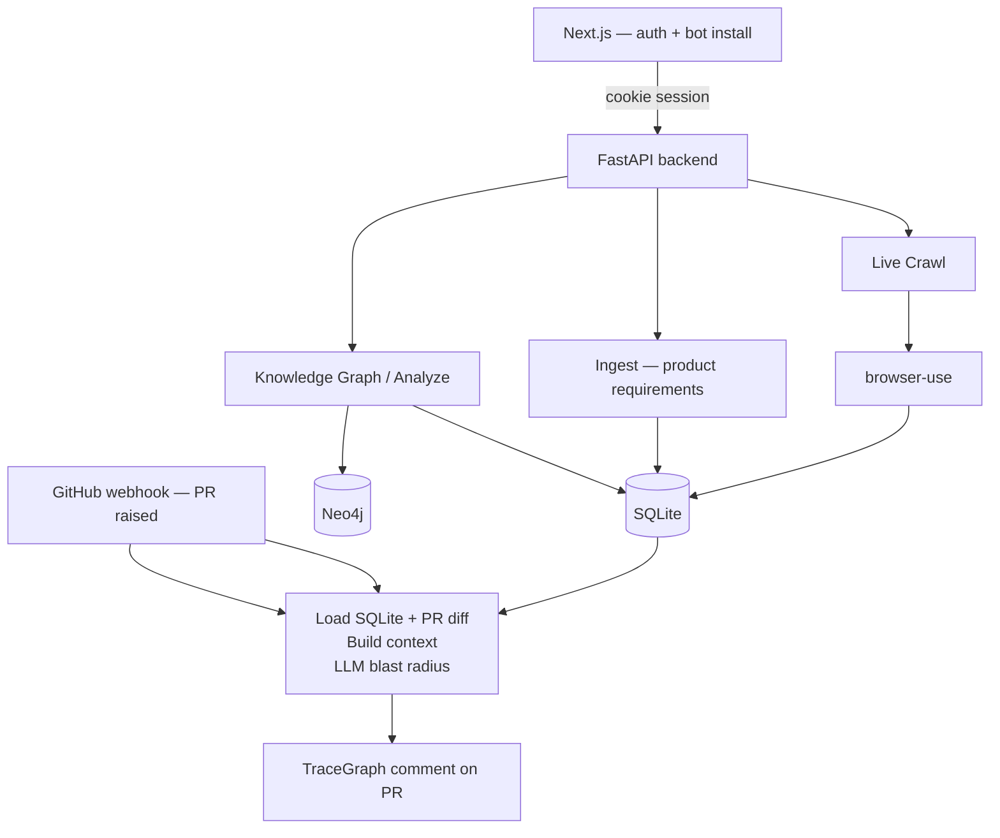
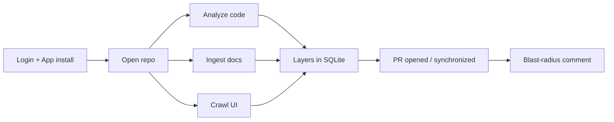
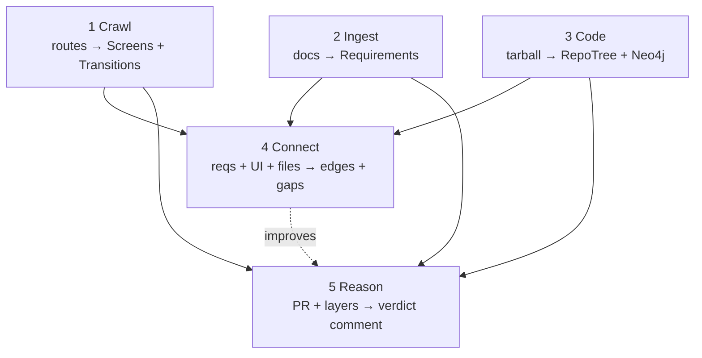
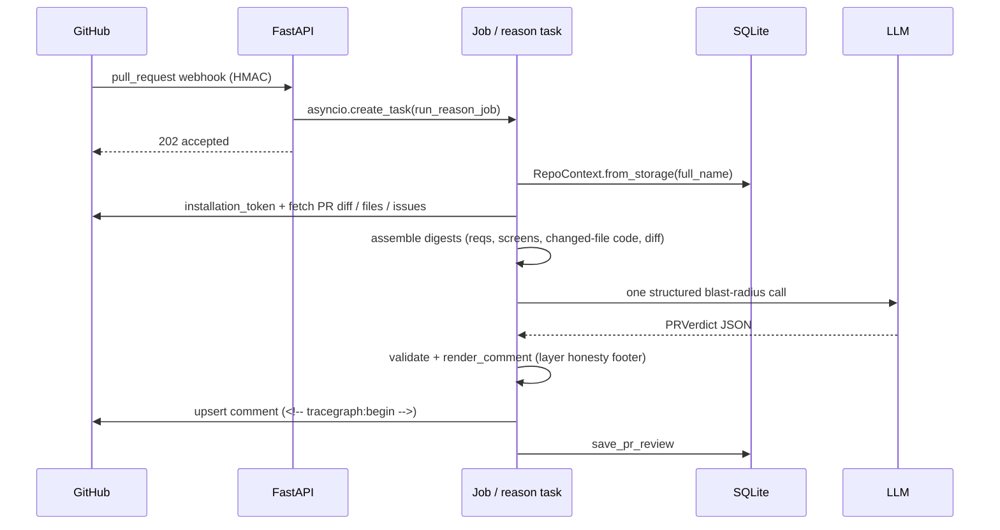
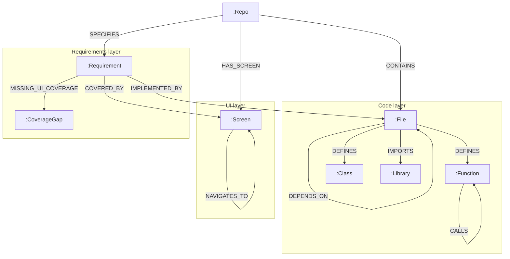

# TraceGraph - Design Document (Part B)

A testing-intelligence system that crawls a live app, ingests a product spec, builds a three-layer knowledge graph (**Requirements / UI / Code**), and reasons about the blast radius of a real Pull Request - then posts a comment a non-engineer QA lead can actually read.

**Read this alongside the code.** Where the code and this document disagree, the code wins and I treat the gap as a bug in the document. I have tried hard not to describe anything as “built” that isn’t. Sections that describe intended design are labelled **PLANNED — not built**.

Sample blast-radius output: [`sample_output.md`](./sample_output.md)  
Non-technical overview: [`overview.md`](./overview.md)  
Evolution / eval / scope deep-dive: [`eval_and_scope.md`](./eval_and_scope.md)

---

## 0. System at a glance

TraceGraph is **two processes** plus a small set of external systems:

| Piece | What it does |
|-------|----------------|
| **Backend — FastAPI (Python)** | All heavy work: AST parse, LLM description, Neo4j writes, crawl orchestration, PR review, GitHub App auth. Owns SQLite persistence. |
| **Frontend — Next.js** | Dashboard, OAuth/install UX, job progress polling, viewing trees / crawls / PRs. Talks to the API with a cookie session. It is **not** the database. |
| **SQLite** | System of record for jobs metadata, `repo_trees`, `crawl_results`, `ingest_results`, sessions, PR reviews. What the webhook reads when there is no logged-in user. |
| **Neo4j Aura** | The knowledge graph. One shared instance; every repo is its own namespaced subgraph. Core to the *graph* product; soft-optional at runtime so analyze/PR still work if Aura is down. |
| **browser-use cloud** | The crawler. We do not drive a local Playwright browser ourselves. |
| **LLM providers** | GLM → Groq → Gemini fallback (`core/llm.py`). High-volume describe/ingest and the cross-layer / blast-radius calls share this client. |
| **GitHub OAuth** | Human login + user token for listing repos and fetching tarballs from the dashboard. |
| **GitHub App** | Installation token, webhooks, posting/updating PR comments. Separate from OAuth on purpose. |

### System architecture



*Figure 1 - End-to-end architecture: Next.js + GitHub webhook into FastAPI; three prep lanes (Knowledge Graph → Neo4j, Ingest → parse docs, Live Crawl → browser-use); artifacts converge in SQLite; on PR, load SQLite + diff → LLM blast radius → TraceGraph comment on the PR.*

The same shape as a Mermaid sketch (for readers who prefer text diagrams):



**How to read Figure 1 in one breath:** the dashboard builds three memories of the product; SQLite holds them; a PR webhook loads that memory plus the diff; one LLM call writes the blast-radius comment back to GitHub.

**Important split:** OAuth is for humans using the dashboard. The GitHub App is for the bot. Installing the App is not the same as “Track” (favorites) and not the same as logging in.

---

## 0.1 Operator journey through the dashboard

The stages map to actions an operator takes from the dashboard, in order. Each of analyze / ingest / crawl is independently re-runnable. Reason is event-driven off GitHub (or a manual `POST /reason`).

| # | Operator action | API | What gets stored |
|---|-----------------|-----|------------------|
| 1 | Sign in + install GitHub App | `/auth/github/*` | `users`, `sessions`, `github_installations` |
| 2 | Open a repo (optional Track) | `/repos/...` | `tracked_repos` (favorites only) |
| 3 | Generate knowledge graph | `POST /analyze` | `repo_trees` + Neo4j code subgraph |
| 4 | Ingest documentation | `POST /ingest` | `ingest_results` |
| 5 | Crawl the live app | `POST /crawl` | `crawl_results` (+ `artifacts/<run_id>/`) |
| 6 | *(Optional)* Connect layers | `POST /graph/connect` | Cross-layer Neo4j edges + gaps |
| 7 | Open / sync a PR | Webhook → reason job | `pr_reviews` + GitHub comment |



*Figure 2 — Operator journey. Stages 3–5 can run in any order; Reason only needs whatever is already stored (and degrades honestly when a layer is missing).*

**Jobs model:** each of analyze / crawl / ingest is `asyncio.create_task` inside the API process. The HTTP handler returns a `job_id` immediately; the UI polls `GET /jobs/{id}` about every 1.5s. There is **no Redis/Celery**. Live progress lives in memory (lost on API restart). Completed artifacts in SQLite survive.

**Running example:** a real public app + repo you connect in the dashboard (for our demos, a Streamlit-style expense / todo style app works well because the UI is Python and the code layer can see the same files the screens come from). A UI-only PR is the textbook blast-radius case: look changes everywhere, engine logic nowhere. See [`sample_output.md`](./sample_output.md) for a real comment shape.

---

## 1. Why this shape (product thesis)

Code review tools are good at diffs. They are weak at the question a QA lead actually asks: *what product behavior does this PR touch?*

- Static analysis sees functions.  
- E2E suites see clicks.  
- Specs live in markdown nobody re-reads.  

Those layers rarely meet in one place, so reviewers guess. TraceGraph’s bet:

1. Build **structure you can trust** (AST edges, screen transitions from real hrefs) once.  
2. Attach **language** with bounded LLM calls (descriptions, requirements, verdict).  
3. At PR time, **assemble** those layers + the diff and ask for one structured blast-radius judgement.  

We deliberately did **not** build a free-roaming “agent that does everything in one loop.” That is hard to debug and easy to oversell. The brief asked for judgement under time pressure — a pipeline with hard boundaries is the honest answer.

---

## 2. Agent decomposition

### 2.1 The honest claim first

This is **not one agent loop**. It is a pipeline of stages, each with a hard boundary, and **exactly one** of them is genuinely agentic (the crawler delegates open-ended page understanding to browser-use). The other stages are deterministic orchestration wrapped around bounded, single-purpose LLM calls.

I think that is the right shape for this problem. I am not going to dress a chain of prompts up as an “autonomous agent.” Calling everything an agent is how you get systems nobody can debug.

### 2.2 The five stages and their boundaries



*Figure 3 — Five stages. Connect improves the graph for absence queries; Reason today primarily reads SQLite digests + diff (see honesty notes below).*

| # | Stage | Input → Output | Boundary (why it ends here) |
|---|--------|----------------|------------------------------|
| 1 | **Crawl** | route list → Screen + Transition records | Ends when each supplied URL (and expanded sidebar views) has one structured screen summary. No discovery beyond that. |
| 2 | **Ingest** | doc URL / repo → `Requirement[]` | Ends when prose is split and each section is turned into testable requirements. |
| 3 | **Code** | repo tarball → `RepoTree` + Neo4j code subgraph | Ends when AST + descriptions + structural / dependency / call edges are written. |
| 4 | **Connect** | reqs + crawl + file paths → cross-layer edges + gaps | Ends when every requirement is linked or explicitly marked uncovered. **API built; dashboard button not wired yet.** |
| 5 | **Reason** | PR diff + stored layers → blast-radius verdict | Ends when one validated verdict is upserted on the PR. |

Stages 1–3 run from the dashboard (separate jobs/endpoints). Stage 5 is event-driven off the GitHub webhook. The boundaries are real because each stage **persists** its output to a store the next stage reads — they are not function calls chained only in memory. You can re-run stage 5 many times without re-crawling. That decoupling is the point: the expensive graph/tree is built once; reasoning is cheaper and repeatable.

### 2.3 Deterministic vs LLM — the actual split

This is the question that matters. Here is the real line, per stage:

| Stage | Deterministic | LLM-driven | Why split there |
|-------|---------------|------------|-----------------|
| **Crawl** | URL normalisation, screen-id hashing, screen-relationship graph from hrefs (`_build_relationships`), screenshot download | Per-screen semantic read (title, label, purpose, actions, components) | Graph topology is a fact from links — never ask a model for something `urljoin` can compute. “What is this screen for” is judgement. |
| **Ingest** | Fetch, markdown heading split (`_split_sections`), stable `R{n}` ids | Prose → `{user_action, expected_outcome}` requirements | Splitting on `#` headings is regex. Turning a paragraph into a testable requirement is judgement. |
| **Code** | `ast.parse` → symbols, imports, call names; import resolution; all Neo4j edge writes (`CALLS`, `DEPENDS_ON`, …) | One structured call per file = file + symbol descriptions | The graph structure is compiler-grade fact from the Python AST. Only the natural-language description is LLM. The model never decides what calls what. |
| **Connect** | All Cypher writes; absence computation (booleans + `CoverageGap`) | One call mapping each requirement → screens + files | Mapping “R3” to “the Balance screen” is semantic. The LLM only proposes links; writes only keep ids that exist in the provided lists. |
| **Reason** | PR fetch, diff truncation, layer assembly, comment upsert | One call producing the blast-radius verdict | The verdict is the irreducible judgement. Everything feeding it and everything after it is deterministic. |

**The principle, stated once:** the LLM decides links and language; Cypher and Python decide truth. Every LLM output is constrained (JSON / Pydantic) and validated; anything that references an id or path not in the input is dropped.

### 2.4 Execution trace of the Reason stage

The Reason stage is the most integrated path — event-driven, multi-system, with exactly one LLM call boxed in the middle.



*Figure 4 — Reason stage. Everything before and after the single LLM arrow is deterministic: token minting, fetch, layer assembly, diff truncation, marker-based comment upsert.*

### 2.5 Why this isn’t “a chain of prompts”

Three concrete reasons:

1. **The graph / tree is the system’s memory, and most of it is not LLM-authored.** Call graph, dependency graph, and inheritance edges come from `ast`, not a prompt. Reasoning over structure you can trust is what separates this from “summarise the diff.”  
2. **The LLM is boxed.** Stages use bounded structured calls with schema validation and id-whitelisting. There is no free-roaming tool-use loop except inside browser-use, where open-ended page understanding is the actual job.  
3. **Stages degrade independently.** Drop the LLM keys and you still get AST structure and screen-relationship edges from hrefs. Drop Neo4j and you still get a PR verdict off the diff + cached tree in SQLite. A brittle prompt chain falls over when any link is missing; this does not.

**Honest cost of this shape:** there is no global planner. Nothing reflects on “did stage 3 produce enough for stage 5.” Stages are sequential and a bit dumb. For a time-boxed build that is the right trade — a planner is something I’d add only after eval exists to tell me it’s needed (see §8 / §10).

---

## 3. Pipeline deep dives

### 3.1 Crawl pipeline (`crawler.py`)

**How it starts.** Dashboard `LiveCrawl` → `POST /crawl` with `base_url`, `routes[]`, optional `login`, and `full_name`. FastAPI creates a crawl job and runs `run_crawl_job` in the background.

**URL discovery.** User-supplied routes only (default `/`). We do **not** spider the open web. After a route capture, Streamlit-style **sidebar views** are expanded from labels the agent returns (`Navigate: …`), then captured as separate screens.

**Page navigation & screenshots.** browser-use cloud runs a task prompt per route/view (“go to this URL, analyze only this page”). Screenshots come back as presigned URLs and are downloaded into data URIs for the live feed.

**HTML / DOM.** We do not ship a full DOM dump pipeline in the current path. The agent returns a structured summary (`title`, `label`, `purpose`, `primary_actions`, `key_components`, `links`). Older schema fields from an earlier Playwright-era crawler still exist on `ScreenInfo` but are largely unused — called out as a gap in §9.

**Relationships.** `_build_relationships` turns real `href`s into `Transition` edges between captured screens. If there are no link edges, `_build_sidebar_flow` chains screens in capture order.

**Errors.** Per-route agent failures are logged and skipped; zero screens with errors fails the job; screens without images succeed with a `capture_note`. No automatic retry loop — re-run the job.

**Output.** `CrawlResult` → SQLite `crawl_results` + `artifacts/<run_id>/manifest.json`. Live `on_screen` updates let the UI show screens as they arrive.

### 3.2 Ingest pipeline (`ingest.py`)

**Purpose.** Turn product docs into a **stable, QA-shaped list of requirements** — not a vector index.

1. Fetch source (`github_repo` tarball `.md`/`.vdk`, README API, URL, or raw text).  
2. Split on markdown headings.  
3. Bounded concurrency: one LLM JSON call per section → `Requirement` (`title`, `description`, `user_action`, `expected_outcome`, `source_anchor`).  
4. Assign `R1…Rn`.  
5. Optional overview LLM call.  
6. Persist `ingest_results`.

**Why not embeddings?** PR review needs the same small structured list every time. Paying once at ingest and stuffing titles into the reason prompt is more controllable than nearest-neighbor chunks for this product question.

### 3.3 Code / knowledge graph pipeline (`ast_parser.py`, `describer.py`, `graph.py`)

1. Download GitHub tarball (Python files capped by settings).  
2. `ast.parse` → `FileInfo` (imports, functions, classes, call names).  
3. `describe_tree` — one LLM JSON description per file (bounded concurrency).  
4. **Always** `save_repo_tree` to SQLite.  
5. If `NEO4J_URI` is set: `DETACH DELETE` that repo’s prior subgraph, then MERGE structural and behavioural edges. Graph failures are soft-caught in the analyze job so the tree still lands in SQLite.

**Neo4j is core to the graph feature** (this is how we *show* and query the repo as a graph). It is **soft-optional as a runtime dependency** so local demos and webhooks do not hard-fail when Aura is unset. For assignment demos, run with Neo4j configured and show the console queries.

### 3.4 Connect layers (`graph_layers.py`)

One LLM mapping call proposes `req → screens` and `req → files`. Cypher writes `SPECIFIES`, `HAS_SCREEN`, `NAVIGATES_TO`, `COVERED_BY`, `IMPLEMENTED_BY`, and `MISSING_UI_COVERAGE` for uncovered requirements. Only ids present in the input lists survive.

**Status:** backend endpoint `POST /graph/connect` works. The dashboard does not call it yet. Labelled honestly in §9.

### 3.5 Reason / report (`pr_review.py`, `github_app.py`)

1. Webhook HMAC verify; accept `opened` / `reopened` / `synchronize` / `ready_for_review`.  
2. `RepoContext.from_storage(full_name)` — newest tree / crawl / requirements (empty `user_id` path for webhooks).  
3. Installation token → PR title, body, diff, changed files, linked issues.  
4. Resolve tree (cached or live AST+describe on head).  
5. Assemble one user message: requirements digest + crawl screens + changed-file code digest + graph summary/console URL + diff.  
6. One LLM call → `PRVerdict`.  
7. `render_comment` with layer honesty footer.  
8. Upsert comment using `<!-- tracegraph:begin -->` … `<!-- tracegraph:end -->` so synchronize edits one comment instead of spamming.  
9. `save_pr_review`.

---

## 4. Graph schema with justification

### 4.1 Three layers in one per-repo subgraph

Every node is namespaced by repo `full_name` (keys like `owner/repo:path` or `owner/repo::req::R3`). One Aura instance holds many repos as isolated subgraphs; rebuilding one `DETACH DELETE`s only that repo’s reachable nodes. That is the cheapest multi-tenant isolation on a shared free-tier instance.



*Figure 5 — Three-layer schema (simplified). Code edges are denser in Neo4j than this sketch; see tables below.*

### 4.2 Node types

| Layer | Node | Key fields | Source |
|-------|------|------------|--------|
| Code | `Repo` | `full_name`, `summary` | tarball / analyze |
| Code | `File` | `path`, `loc`, `description`, `imports` | AST + describer |
| Code | `Function` (`:Method` if on a class) | `name`, `args`, `calls`, `description` | AST |
| Code | `Class` | `name`, `bases`, `description` | AST |
| Code | `Library` | `name`, `external=true` | resolved imports |
| Code | `Decorator` | `name` | AST |
| UI | `Screen` | `url`, `title`, `label`, `authenticated` | crawl |
| Req | `Requirement` | `req_id`, `title`, `user_action`, `expected_outcome`, coverage flags | ingest + connect |
| Absence | `CoverageGap` | `reason` | connect |

### 4.3 Edge types

**Structure / behaviour (code):** `CONTAINS`, `DEFINES`, `HAS_METHOD`, `DEPENDS_ON`, `IMPORTS`, `USES`, `CALLS`, `INSTANTIATES`, `INHERITS_FROM`, `DECORATED_BY`.

**Cross-layer:** `SPECIFIES`, `HAS_SCREEN`, `NAVIGATES_TO`, `COVERED_BY` (req→screen), `IMPLEMENTED_BY` (req→file), `MISSING_UI_COVERAGE` (req→gap).  
**PLANNED — not built as a first-class edge yet:** `RENDERED_BY` (screen→file/component) for non-Python UIs.

### 4.4 How absence is modelled — and why it is a node

The brief calls this out, so it gets care. Absence is modelled three ways on purpose:

1. **Boolean state on the requirement** — `covered_by_ui` / `implemented_in_code`. Absence is a property, queryable without traversal.  
2. **A first-class `CoverageGap` node** + `(:Requirement)-[:MISSING_UI_COVERAGE]->(:CoverageGap)`. Absence becomes visible in the graph view and gives a place to attach a reason (and later severity/owner).  
3. **Default-to-uncovered.** If the mapping LLM is absent or unsure, the requirement stays uncovered and gets a gap. Presence must be proven. A requirement is only “covered” if the model named a screen that actually exists in the crawl.

**Why not just “a requirement with no `COVERED_BY` edge”?** Missing data and proven-absent look identical in that model — you cannot distinguish “we never ran the crawl” from “we crawled and the feature genuinely isn’t there.” Making the gap an explicit node lets the absence query return a row that means something *asserted*, and lets the report say “this requirement should be testable and isn’t” with a clearer story.

### 4.5 Justify the schema against real queries

**Query A — which intended behaviours have no way to be tested in the product as built?**

```cypher
MATCH (r:Requirement {full_name:$repo})-[:MISSING_UI_COVERAGE]->(:CoverageGap)
RETURN r.req_id, r.title
```

One hop, index-friendly on `full_name`. Before a UI exists this returns (almost) everything; after a crawl + connect, it returns the short sharp list of requirements with no surfaced control.

**Query B — if this file changes, which requirements lose coverage?**

```cypher
MATCH (f:File {key:$repo + ':' + $path})<-[:IMPLEMENTED_BY]-(r:Requirement)
OPTIONAL MATCH (r)-[:COVERED_BY]->(s:Screen)
RETURN r.req_id, r.title, collect(s.label) AS screens_that_test_it
```

Two hops from the changed file (what a PR gives you) out to impact. Edge directions were chosen for that fan-out.

**Honesty about Reason today:** the shipping reason path assembles SQLite digests for the LLM rather than running these Cypher queries live. The schema and Connect API exist so those queries are real; wiring Reason to Cypher neighborhoods is a next step (§10), not something I will pretend is already in the hot path.

---

## 5. Data flow by feature

### 5.1 Analyze

| | |
|--|--|
| **Input** | `{ full_name, ref, build_graph }` + user OAuth token |
| **Processing** | tarball → AST → LLM describe → Neo4j MERGE |
| **Output** | `RepoTree` on the job + UI graph/tree views |
| **Writes** | `jobs`, `repo_trees`; Neo4j nodes/edges |
| **External** | GitHub tarball, LLM, Neo4j |

### 5.2 Crawl

| | |
|--|--|
| **Input** | `base_url`, routes, optional login, `full_name` |
| **Processing** | browser-use per route/view; build transitions |
| **Output** | `CrawlResult` + live screen feed |
| **Writes** | `jobs`, `crawl_results`; disk `artifacts/` |
| **External** | browser-use API |

### 5.3 Ingest

| | |
|--|--|
| **Input** | `source`, `source_type`, token as needed |
| **Processing** | fetch → section split → LLM requirements → overview |
| **Writes** | `jobs`, `ingest_results` |
| **External** | GitHub / HTTP + LLM |

### 5.4 Reason

| | |
|--|--|
| **Input** | Webhook payload or `POST /reason` |
| **Processing** | load context → fetch PR → LLM verdict → markdown |
| **Output** | GitHub PR comment |
| **Writes** | `pr_reviews`; reads the three artifact tables |
| **External** | GitHub App + LLM |

---

## 6. Confidence handling under ambiguity

### 6.1 What’s actually built

Numeric confidence and an automated human-in-the-loop stop are **NOT built**. I am not going to pretend otherwise. What exists today is structural and conservative:

1. **Absence-as-default (§4.4).** When the agent can’t map a requirement to a screen, it doesn’t guess — it records a gap (when Connect runs). Ambiguity resolves toward “uncovered,” which is the safe direction for a risk tool.  
2. **Id / path whitelisting.** A cross-layer link only survives if the screen/file it names exists in the input (`graph_layers.py`). The model cannot express false confidence in a thing that isn’t there.  
3. **Layer-presence honesty in the output.** The PR comment footer states which of the three layers actually informed it (`render_comment`: ✅ / ⚪). A non-engineer can see what the system was blind to. That is the most important “confidence” signal in the product right now.  
4. **Prompt-level honesty + coarse risk.** The reasoner is told not to invent links; the verdict carries `risk: low|medium|high`.  
5. **Graceful degradation.** No key / no graph / no crawl never crashes the webhook path — it produces a narrower report that admits its narrowness.

So the current answer to “what happens when it isn’t sure” is: **widen the gap set, narrow the claim, and tell the reader what it couldn’t see.** Defensible for v1. It does **not** quantify uncertainty or pause for a human.

### 6.2 PLANNED — not built

The right design, scoped out for time:

- A numeric confidence per cross-layer edge = f(model self-rating, name-match strength, agreement across N sampled mappings). Store it on the edge.  
- Three stop conditions that route to a human review queue instead of auto-posting: (a) high-risk verdict on a file tied to many requirements; (b) “covered” below confidence threshold; (c) changed function that maps to no file node.  
- Surface confidence as a **band** in the report (“high / needs a human”), not a fake-precise decimal.

I’d only build this after §7 (eval), because without eval I can’t calibrate a threshold and would just be inventing numbers.

---

## 7. Eval approach

**Honest status: no eval harness is built.** This is a real gap. Here is how I’d know the output is right — including the “100 runs” answer.

### 7.1 The core problem

Stages Crawl, Ingest, Connect, and Reason each contain LLM calls. Re-run 100× on the same PR:

- **Structure** (AST graph, screen-relationship graph from hrefs) is bit-identical — `ast` and `urljoin`.  
- **Descriptions, requirement phrasings, cross-layer links, and verdicts will drift.**

Eval must treat those halves differently.

### 7.2 Two-tier eval

**Tier 1 — deterministic invariants (must hold every run, asserted in CI):**

- AST node/edge counts stable for a fixed commit.  
- Every `COVERED_BY` / `IMPLEMENTED_BY` edge points at an id that exists.  
- Absence complete: `count(uncovered) + count(covered) == count(requirements)`.  
- Verdict validates against `PRVerdict`; required fields present.

These catch the failures that actually break the product (broken graph, hallucinated ids, malformed output).

**Tier 2 — judgement quality (LLM outputs):**

- A small **golden set** of real PRs with hand labels (e.g. UI-only redesign → UI + flows at risk, engine requirements untouched).  
- Metric: set-level precision/recall of `requirements_at_risk` and `ui_at_risk` vs golden labels. **Absence recall** is the headline number (false negatives are the dangerous failure).  
- **Stability under resampling (the 100-runs answer):** run each input N=10 times; report agreement rate per field (e.g. “R3 flagged in 9/10 runs”). High-agreement claims are trustworthy; low-agreement claims are exactly what §6’s confidence band should down-rank. Which runs are “correct” = match golden labels; which claims are trustworthy = stable across resamples. Those are two different questions.  
- LLM-as-judge for description/verdict readability on a rubric, with human spot-checks.

### 7.3 What I would not claim

I would not report a single accuracy number off one repo and call it validated. The system isn’t proven until the golden set spans several apps — including a JS/TS frontend (which needs the web AST work in §10).

---

## 8. Architecture decisions (engineering reasoning)

| Decision | Why this approach | Alternatives | Trade-off |
|----------|-------------------|--------------|-----------|
| **SQLite as bot source of truth** | Webhooks have no user session; need durable latest artifacts per repo | Postgres; Neo4j-only; frontend DB | Simple locally; JSON blobs (screenshots) can grow |
| **In-process asyncio jobs** | Two-process local setup; no Redis in 16h | Celery / RQ / cloud queues | Progress lost on restart; no horizontal workers |
| **Neo4j soft-optional write** | Graph explore is core; PR path must survive Aura down | Hard-require Neo4j | Reason doesn’t Cypher-traverse yet |
| **Fixed crawl routes** | Reproducible, budget-safe, low hallucination | Autonomous click-spider | Misses unknown pages |
| **browser-use cloud** | Semantic labels without maintaining a browser harness | Self-hosted Playwright + LLM | Less raw DOM/a11y control |
| **Structured requirements, not RAG** | Stable QA list every PR | Embeddings + vector search | No semantic wiki search |
| **Python AST first** | Depth on the graph in limited time | Multi-language parsers day one | JS/TS UIs don’t fully close code↔screen |
| **OAuth + separate GitHub App** | Correct GitHub model for comments/webhooks | OAuth-only bot | Two install concepts for users |
| **Upsert comment markers** | `synchronize` would spam threads | Check runs / status API | Markers are a bit crude but work |

---

## 9. Scope decisions

The brief is explicit that honest scoping beats polished hand-waving.

### 9.1 What I went deep on

**The Code layer + knowledge graph (deepest).** Full Python `ast` parse → functions / classes / methods / imports, then resolved edges: internal imports → `DEPENDS_ON`, imported symbols → `USES`, call names → in-repo `CALLS`, plus `INSTANTIATES` / `INHERITS_FROM` / `DECORATED_BY`. This is compiler-grade structure, not LLM guesswork. Per-repo namespacing, idempotent MERGE writes, and ready-made connector queries live here. I invested here because **the graph is the system’s memory** — if it’s soft, everything downstream is soft.

**The Reason stage + real GitHub integration (deep).** Working GitHub App: JWT → installation token → fetch PR diff + linked issues → reason across stored layers → upsert a single self-updating comment. Runs on real PRs. Output framed for a non-engineer (UI at risk / flows affected / requirements losing coverage) with explicit layer honesty.

### 9.2 What I went medium on

**Ingest / Requirements.** Deterministic heading-split + one bounded LLM call per section into testable `{user_action, expected_outcome}`, plus a whole-doc overview. Solid, but granularity follows the doc’s headings — no merging of duplicates across sections, no priority inference.

**Crawl / UI.** Working browser-use path with live progress and sidebar expansion. Intentionally not an autonomous explorer.

### 9.3 What I cut, and why

| Cut | Why |
|-----|-----|
| Autonomous crawl | Fixed route list is reproducible and low-hallucination; open-world clicking burns budget and invents state |
| Self-hosted Playwright DOM dumps | Outsourced to browser-use for semantic summaries in limited time |
| Durable job queue | Local two-process DX first; flagged in README as future work |
| Vector / RAG stack | Wrong abstraction for “stable requirements list” |
| Numeric confidence + HITL | Needs eval first (§7) or thresholds are fiction |
| Dashboard wiring for `/graph/connect` | API exists; UI not connected — honest gap |
| JS/TS frontend AST | Second build; see §10 |

### 9.4 Gaps I found while writing this

1. **Reason does not yet run the absence Cypher query in the hot path** — it uses SQLite digests + LLM. Schema supports the query; product path should grow into it.  
2. **Crawler schema drift** — `ScreenInfo` still carries older Playwright-era fields the current crawler doesn’t populate. Dead contract / cleanup owed.  
3. **Code↔UI linking depends on UI language** — Python Streamlit UIs close the loop in the same AST; a normal React app falls back to joining through Requirements until a web AST exists.  
4. **Cross-layer mapping is one LLM call** — no resampling/voting, so a single bad mapping is unguarded when Connect runs.  
5. **In-memory job store** — fine for demo; needs Redis (or similar) to scale.

I’d rather hand you this list than have you find it.

---

## 10. What I’d build with another week — top 3, in order

### 10.1 Wire Connect into the dashboard and feed absence into Reason — highest product value

Finish the three-layer loop the brief asks for in the UI operators actually use. Then have Reason optionally pull `MISSING_UI_COVERAGE` rows into the prompt (or cite them deterministically in the comment). This turns absence from “schema we can query in Neo4j Browser” into “something the PR comment always sees.”

### 10.2 An eval harness with an LLM judge — unblocks everything else

Build §7: Tier-1 invariants in CI, small golden set, precision/recall on at-risk fields, N-run agreement metric, LLM-as-judge on readability with human spot-checks. Second because without numbers I can’t honestly tune confidence (§6.2) or claim quality.

### 10.3 A web-app AST (HTML/JS/TS) so Code and UI connect on real customer apps

Today the loop closes cleanly when the UI is Python. Point TraceGraph at a normal React app and “this code change touches that screen” weakens. A tree-sitter (or similar) frontend layer → `(:Screen)-[:RENDERED_BY]->(:Component)` makes blast radius end-to-end regardless of UI language. Third only because Connect+eval make the current Python path trustworthy first; then expand languages.

**Honorable mention:** durable job queue once the product is worth operating beyond a laptop.

---

## Appendix A — Stack & responsibility map

| Concern | Where | Det / LLM |
|---------|-------|-----------|
| Crawl a live app | `crawler.py` → browser-use cloud | LLM (browse) + Det (graph) |
| Screen-relationship graph | `crawler.py::_build_relationships` | Det |
| Parse a spec → requirements | `ingest.py` | Det split + LLM extract |
| Python AST → `RepoTree` | `ast_parser.py`, `core/tree.py` | Det |
| File/symbol descriptions | `describer.py` | LLM |
| Code subgraph → Neo4j | `graph.py` | Det |
| Connect 3 layers + absence | `graph_layers.py` | Det writes + 1 LLM map |
| PR blast-radius reasoning | `pr_review.py` | 1 LLM |
| GitHub App auth + comment | `github_app.py` | Det |
| Orchestration / jobs | `jobs.py`, `api/routes.py` | Det |
| Persistence | `storage.py` (SQLite) | — |
| Dashboard | `frontend/` | polls API |

---

## Appendix B — Sample output

See [`sample_output.md`](./sample_output.md) for a real TraceGraph PR comment (UI polish PR: screens/flows at risk, requirements losing coverage none, suggestions included, layer honesty footer).