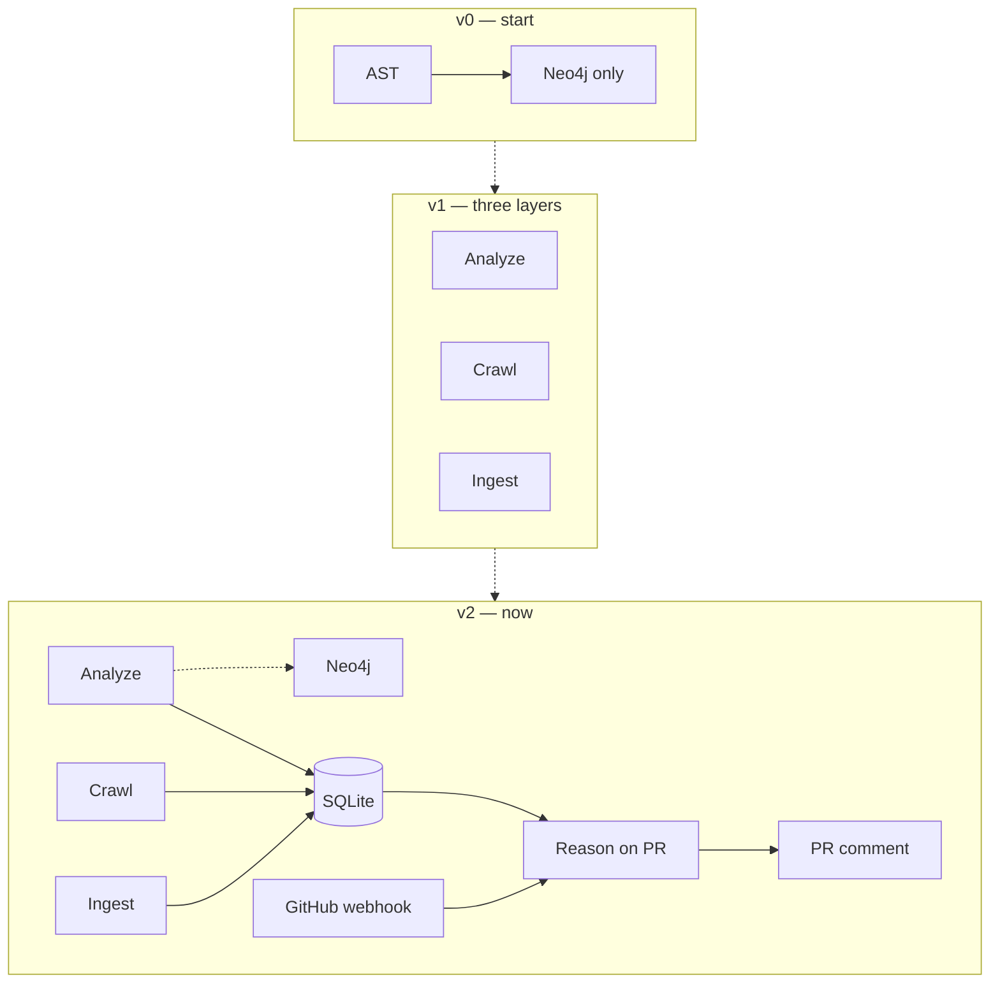

# TraceGraph — Evolution, Eval & Scope

**What we started with, how the architecture changed, what we cut, how we’d know it works, and what we’d build next.**

This document is the honest “Part B” companion on **scope and evaluation**. The full technical design (with the architecture diagram) lives in [`system_design.md`](./system_design.md). The non-technical story is in [`overview.md`](./overview.md).

Where this document and the code disagree, **the code wins**.

---

## 1. How the architecture evolved

We did not invent the final diagram on day one. The system grew in three clear steps.

### v1 — Three layers + dashboard

```
Analyze  → code tree + Neo4j
Crawl    → screens (browser-use)
Ingest   → requirements from docs
All three saved for the repo
```

**Goal:** Meet the brief’s three layers (Requirements / UI / Code) in one product.  
**What worked:** Operators could build each layer from the dashboard as separate jobs.  
**What was still missing:** A path that runs when nobody is looking at the UI — i.e. a GitHub webhook that can load the latest artifacts without a browser session.

### v2 — What we ship now (Figure 1)


*Figure 1 — Current architecture. Prep lanes write into SQLite (and Neo4j for the code graph). A PR webhook loads SQLite + the diff, runs one LLM blast-radius call, and posts a TraceGraph comment.*



**The idea that stuck across all versions:** build expensive structure once and store it; keep PR reasoning thin, repeatable, and honest about which layers it actually saw.

---

## 2. Big trade-offs (and why we chose them)

These are the decisions a founder or senior engineer will push on. Each row is a real fork we took.

| Decision | Alternative we rejected | What we chose | Why | What we gave up |
|----------|-------------------------|---------------|-----|-----------------|
| **Where “truth” lives for the bot** | Frontend database; Neo4j-only | **SQLite on the backend** | Webhooks have no login cookie; the bot needs the latest tree/crawl/requirements for `owner/repo` | Not a multi-node DB; large JSON (screenshots) can grow the file |
| **How background work runs** | Redis + Celery / cloud queues | **`asyncio` tasks inside the API process** | Local setup stays two processes (API + frontend); less infra in a time-boxed build | Live job progress dies if the API restarts; no horizontal worker fleet |
| **Neo4j** | Always required for every path | **Core graph feature; soft-optional runtime** | Exploring the repo graph matters; PR comments must not die if Aura is misconfigured | The shipping Reason path does not yet run Cypher neighborhood queries live |
| **How much the crawler explores** | Autonomous “click everywhere” agent | **User-supplied route list** (+ sidebar view expansion) | Reproducible, cheaper, fewer hallucinated transitions | Will not discover unknown pages by itself |
| **Who drives the browser** | Self-hosted Playwright + our own DOM pipeline | **browser-use cloud** | Semantic screen labels without maintaining a browser harness | Less control of raw DOM / a11y artifact dumps |
| **How docs become memory** | Embeddings + vector search (RAG) | **Structured requirements list** | Every PR needs a stable, QA-shaped checklist — not nearest-neighbor chunks | No “semantic search the wiki” feature |
| **Which languages the code layer reads** | Multi-language parsers on day one | **Python `ast` first** | Depth on a trustworthy graph in limited time | Normal React/JS UIs don’t fully close code↔screen yet |
| **GitHub integration** | OAuth-only bot | **OAuth for humans + GitHub App for the bot** | Comments and webhooks need an App installation token | Two install concepts (login vs App) that we must explain in the UI |

### Neo4j — say this carefully in interviews

- **Product-core:** we *do* build a real knowledge graph of the repo (files, calls, imports, inheritance, …).  
- **Runtime soft-optional:** if `NEO4J_URI` is unset or Aura fails, analyze still saves the tree to SQLite and the bot can still comment.  
- **For demos and the assignment:** run with Neo4j on and show the graph. That is the intended showcase path.

---

## 3. Scope decisions — deep / medium / cut

The assignment brief says a working narrow slice with honest scope beats three half-done layers. Here is the real accounting.

### 3.1 What we went deep on

1. **Code layer + Neo4j schema**  
   Full Python AST → functions / classes / methods / imports, then resolved edges (`DEPENDS_ON`, `USES`, `CALLS`, `INSTANTIATES`, `INHERITS_FROM`, `DECORATED_BY`). Compiler-grade structure. Per-repo namespacing on a shared Aura instance. This is the strongest part of the build because **the graph is the system’s memory**.

2. **Reason stage + real GitHub App**  
   HMAC webhooks, installation tokens, PR diff fetch, one structured blast-radius LLM call, upserted comment with `<!-- tracegraph:begin -->` so synchronize does not spam the thread. Output framed for a non-engineer. See [`sample_output.md`](./sample_output.md).

### 3.2 What we went medium on

3. **Ingest / requirements** — Heading split + LLM extraction into `{user_action, expected_outcome}`. Solid and useful; no fancy dedupe or priority model across sections.  
4. **Crawl / UI** — browser-use per route, live progress, Streamlit sidebar expansion. Working; intentionally not an open-world spider.

### 3.3 What we cut — and why

| Cut | Why we cut it |
|-----|----------------|
| Durable job queue (Redis/Celery) | Local two-process DX first; called out as future infra in the README |
| Autonomous site-wide crawl | Fixed routes are reproducible and low-hallucination; open clicking burns budget and invents state |
| Vector database / RAG ingest | Wrong tool for “stable requirements list every PR” |
| Numeric confidence scores + human-in-the-loop pause | Worthless without an eval harness to calibrate thresholds |
| Dashboard button for `/graph/connect` | Backend API exists; UI not wired — we name the gap instead of hiding it |
| JS/TS (or HTML) frontend AST | Needed for normal web apps to close code↔screen; a second build after the Python path is trustworthy |

### 3.4 Gaps we found while writing the design docs

We would rather list these than have a reviewer discover them:

1. **Reason’s hot path uses SQLite digests + LLM**, not live Cypher absence queries — even though the schema and Connect API support those queries.  
2. **`ScreenInfo` still has older Playwright-era fields** the current browser-use crawler does not fill (schema drift).  
3. **Code↔UI linking is strongest when the UI is Python** (e.g. Streamlit). A React app currently joins layers mainly through Requirements until a web AST exists.  
4. **Cross-layer mapping is a single LLM call** when Connect runs — no voting / self-consistency yet.  
5. **In-memory job progress** is fine for a demo laptop; it is not an operations story.

---

## 4. Confidence under ambiguity

### What’s built (conservative, not scored)

When the system is unsure, it does **not** invent coverage:

- Default toward **uncovered** requirements (safe direction for a risk tool).  
- Cross-layer links only keep **ids that actually exist** in the crawl/tree input.  
- The PR comment **footer shows which layers informed** the report (✅ / ⚪).  
- Coarse **risk** band: low / medium / high.  
- Missing layer → **narrower report**, not a crash.

### What’s not built

- Numeric confidence floats on edges  
- Automatic “stop and ask a human” before posting  

**Plain English:** today we widen gaps, narrow claims, and tell the reader what we couldn’t see. That is v1. Quantified uncertainty comes after eval.

---

## 5. Eval approach

**Honest status: no eval harness is checked in yet.** Here is the plan we would defend — including the “if we ran it 100 times” question from the brief.

### Why a single accuracy % is the wrong answer

- AST edges and screen-link graphs from real hrefs are **stable** (deterministic).  
- Descriptions, requirement wording, mappings, and verdicts **drift** across LLM runs.

So eval has two tiers.

### Tier 1 — deterministic invariants (CI, must pass every run)

- Same git commit → stable AST node/edge counts.  
- No dangling `COVERED_BY` / `IMPLEMENTED_BY` ids.  
- `covered + uncovered == all requirements` after Connect.  
- Verdict always validates as `PRVerdict`.

These catch broken graphs, hallucinated ids, and malformed output — the failures that break the product.

### Tier 2 — judgement quality

- Small **golden set** of real PRs with hand labels (example: UI-only redesign → UI/flows at risk, engine requirements untouched).  
- Precision/recall on `ui_at_risk` and `requirements_at_risk`. **Absence recall** is the headline metric (missing a real gap is the dangerous failure).  
- **100-runs answer:** run each input N times (e.g. 10). Report agreement per field (“R3 flagged in 9/10”).  
  - **Correct run** = matches golden labels.  
  - **Trustworthy claim** = stable across resamples.  
  Those are two different questions; the harness should answer both.  
- Optional LLM-as-judge on readability, spot-checked by a human.

We would **not** claim the system is “validated” off a single demo repository.

---

## 6. Another week — top 3, in order

1. **Wire Connect into the dashboard and feed absence into Reason**  
   Finish the three-layer loop operators can see, and make `MISSING_UI_COVERAGE` show up in the PR comment path — not only in Neo4j Browser.

2. **Eval harness**  
   Tier 1 in CI + golden set + agreement metric. Unlocks honest quality claims and any future confidence thresholds.

3. **Web frontend code layer (HTML/JS/TS)**  
   So normal customer apps get real screen↔code edges, not Requirements-only joins.

**After that:** durable job queue once the product is worth running beyond a single laptop.

---

## 7. One-page summary for a founder

| Question | Answer |
|----------|--------|
| What is TraceGraph? | Three product maps (code, UI, requirements) + a PR blast-radius comment. |
| What’s deep? | Code knowledge graph + real GitHub App reasoning. |
| What’s thin on purpose? | Crawl (fixed routes), Connect UI wiring, eval harness. |
| Biggest bet? | Trusted structure in graph/SQLite beats one free-roaming agent loop. |
| Biggest risk? | Python-only AST; Reason not yet Cypher-native in the hot path. |
| How did it evolve? | Neo4j-only → three dashboard layers → SQLite + webhook comment loop. |
| What’s next? | Connect in UI → eval → multi-language UI code layer. |

---

Companion docs: [`overview.md`](./overview.md) · [`system_design.md`](./system_design.md) · [`sample_output.md`](./sample_output.md)
