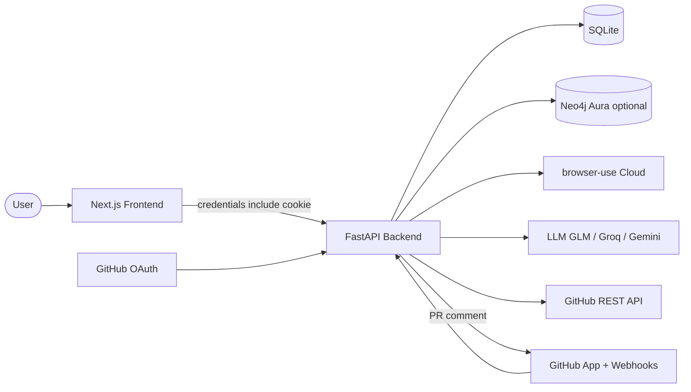
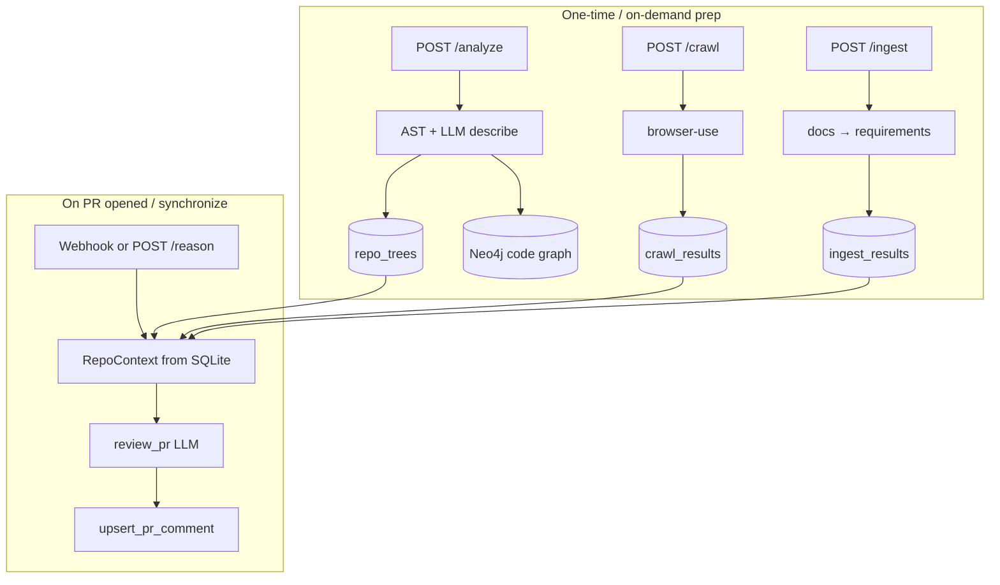

# TraceGraph — Architecture Overview

Interview-ready map of the system. Deep dives, data flows, and decision trade-offs live in [`system_design.md`](./system_design.md). Scope honesty (what we did *not* build) lives in [`eval_and_scope.md`](./eval_and_scope.md).

## One-sentence pitch

TraceGraph connects a GitHub repo’s **code AST**, **live UI crawl**, and **docs-as-requirements**, then comments on PRs with blast radius in plain language for a QA lead.

## Excalidraw / whiteboard boxes

Use these exact names when redrawing:

```
[Next.js UI] --cookie session--> [FastAPI]
                                      |
          +------------+--------------+--------------+---------------+
          |            |              |              |               |
    [Analyze Job] [Crawl Job]  [Ingest Job]  [Reason Job]   [Auth/Repos]
          |            |              |              |               |
     [GitHub API] [browser-use]  [GitHub API]  [GitHub App]    [SQLite]
     [AST+LLM]    [artifacts/]   [LLM reqs]    [PR comment]
     [Neo4j]                                     ^
                                                 |
                                      [GitHub Webhook]
```

## Mermaid — system context



## Mermaid — three layers → PR comment



## Component cheat sheet

| Box | Role | Key files |
|-----|------|-----------|
| Next.js UI | Dashboard, job polling, modals | `frontend/app/dashboard/**`, `frontend/lib/api.ts` |
| FastAPI | Thin routes; spawns jobs | `backend/src/api/routes.py`, `main.py` |
| JobStore | In-memory live progress + SQLite metadata | `backend/src/services/jobs.py` |
| SQLite | Source of truth for artifacts + auth | `backend/src/services/storage.py` |
| Neo4j | Optional code (+ layer-connect) property graph | `graph.py`, `graph_layers.py` |
| browser-use | Cloud browser agent for UI screens | `crawler.py` |
| LLM | Descriptions, requirements, PR verdict | `core/llm.py` |
| GitHub OAuth | User login + repo token | `services/auth.py` |
| GitHub App | Installation token, webhooks, PR comments | `github_app.py` |

## Happy path (what you say out loud)

1. Sign in with GitHub OAuth → `tracegraph_session` cookie on the API origin.
2. Install the GitHub App on the org/repos you care about.
3. On a repo page: **Generate knowledge graph** (`/analyze`), **Ingest docs** (`/ingest`), **Crawl** (`/crawl` with base URL + routes).
4. Open or push to a PR → webhook → `run_reason_job` → blast-radius comment (~1–3 min, LLM-bound).

## Critical interview facts

- **No Redis/Celery.** Jobs are `asyncio.create_task` inside the API process. Restart kills live poll state (`jobs.py` docstring).
- **No vector search.** Retrieval for PR review is “load newest SQLite artifacts + truncate diff + one LLM call.”
- **Neo4j is optional.** Analyze still saves the tree to SQLite if Neo4j fails or is unset.
- **OAuth ≠ App.** OAuth reads the user’s repos; the App posts comments and receives webhooks.
- **Track ≠ Install.** “Track” is a favorites list in SQLite; App install is what enables PR comments.

## Possible Founder Question

> Why three separate pipelines instead of one “index the repo” job?

**Suggested answer:** Different inputs and failure modes. Code needs a tarball + AST; UI needs a live URL and a browser agent; requirements need docs. Separating them lets a team ship PR review with only code+diff, then deepen coverage as crawl/ingest complete — the README’s explicit trade-off.
