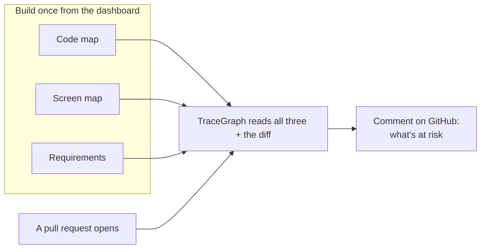
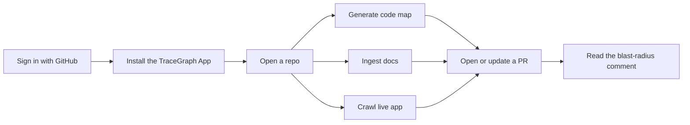

# TraceGraph — Overview

**For non-technical readers, founders, and anyone who wants the story before the code.**

TraceGraph helps a QA lead answer one question when a pull request lands:

> *What product behavior might this change break?*

Code review tools show the diff. They do not show which screens, user flows, or product requirements are at risk. TraceGraph connects those dots and posts a plain-language comment on the GitHub PR.

Technical design (full depth): [`system_design.md`](./system_design.md)  
What we cut and how we’d evaluate: [`eval_and_scope.md`](./eval_and_scope.md)  
Example PR comment: [`sample_output.md`](./sample_output.md)

---

## The idea in one picture

You prepare three views of the product. When someone opens a PR, the bot uses those views plus the code diff to write a blast-radius report a non-engineer can read.

---

## Full system architecture

This is the diagram we designed for the product — the same one in the README.

**How to read it without being an engineer:**

1. **Left side** — You use the TraceGraph website (Next.js), or GitHub sends a “PR raised” signal.  
2. **Middle** — Our server (FastAPI) runs three prep jobs when you ask it to:  
   - **Knowledge graph** — understand the code (and store a graph in Neo4j)  
   - **Ingest** — read product docs into requirements  
   - **Live crawl** — visit the live app with a browser agent  
3. **SQLite** — the shared notebook where those three results are saved.  
4. **Bottom** — when a PR arrives, we load that notebook + the PR diff, ask an AI for blast radius, and post a **TraceGraph comment** on the PR.

One sentence: **the dashboard builds memory; the webhook uses that memory to comment on PRs.**

---

## The three views (in plain language)

| View | Plain meaning | How we get it |
|------|---------------|---------------|
| **Code** | How the software is built — files, functions, what calls what | Download the GitHub repo, parse Python, describe it in English, draw relationships in Neo4j |
| **UI** | What users actually see — screens and how they link | Point a browser agent at your live app’s URLs |
| **Requirements** | What the product was *meant* to do | Read the docs / README and turn them into testable requirements |

Think of it like a map with three layers. The PR is a pin on the map. The bot tells you which neighborhoods that pin touches.

---

## What you do in the product (operator journey)

1. **Sign in** with GitHub.  
2. **Install** the TraceGraph GitHub App on the repos you care about (this is what lets the bot comment — different from just logging in).  
3. Open a repo in the dashboard.  
4. **Generate the knowledge graph** (code map).  
5. **Ingest docs** into requirements.  
6. **Crawl** the live app (you give a base URL and the routes that matter).  
7. Open or push to a **pull request** — TraceGraph comments with UI at risk, flows affected, and requirements that may lose coverage.

You can skip a prep step. The comment still posts, but it is thinner. The footer of the comment shows which layers were available (so nobody is fooled into thinking the bot saw everything).

---

## What the PR comment looks like (conceptually)

The bot does **not** dump raw code. It writes sections a QA lead cares about:

- Overall verdict and risk level  
- **UI at risk** — which screens may break  
- **Flows affected** — which user journeys move  
- **Requirements losing coverage** — what was intended but may no longer be testable / covered  
- **What changed** — in product language  
- **Suggestions** — practical next checks  

A real example lives in [`sample_output.md`](./sample_output.md).

---

## What TraceGraph is not

- Not a replacement for unit tests or full E2E suites  
- Not a “click every link on the internet” crawler (you choose the routes — on purpose, for trust and cost)  
- Not magic that understands every programming language equally (code understanding today is strongest on Python)

It is a **testing-intelligence assistant**: connect intent, UI, and code, then explain PR impact in product language.

---

## Who should read what next

| You are… | Read next |
|----------|-----------|
| Founder / PM | Stay here, then skim scope in [`eval_and_scope.md`](./eval_and_scope.md) |
| QA lead | [`sample_output.md`](./sample_output.md), then try the dashboard |
| Engineer / interviewer | [`system_design.md`](./system_design.md) — full pipelines, graph schema, trade-offs |
