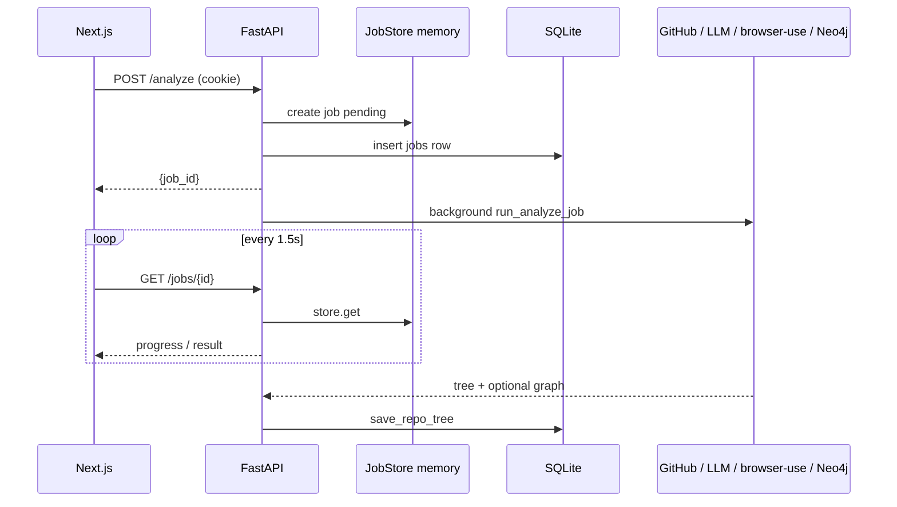

# TraceGraph — System Design (Implementation-Derived)

> Derived from the codebase under `backend/src` and `frontend/`. When something is not implemented, it is labeled **Absent**. Do not treat marketing analogies (e.g. “search”) as architecture unless a file path is cited.

Companion docs: [`overview.md`](./overview.md) · [`eval_and_scope.md`](./eval_and_scope.md)

---

# Task 1 — High-Level Architecture

## 1.1 Real topology

```
┌──────────────────┐   cookie: tracegraph_session    ┌────────────────────────────┐
│  Next.js (3000)  │ ───────────────────────────────▶│  FastAPI (8000)             │
│  App Router UI   │   credentials: "include"         │  src/main.py                │
└──────────────────┘                                  │  routers: auth, repos, api  │
                                                      └─────────────┬──────────────┘
                                                                    │
                    ┌───────────────┬─────────────────┬─────────────┼──────────────┐
                    ▼               ▼                 ▼             ▼              ▼
             Analyze job      Crawl job        Ingest job    Reason job     Auth / Repos
             asyncio task     asyncio task     asyncio task  asyncio task   sync handlers
                    │               │                 │             │              │
                    ▼               ▼                 ▼             ▼              ▼
             GitHub tarball   browser-use       GitHub docs    GitHub App     SQLite users/
             AST + LLM        Cloud SDK         + LLM reqs     PR + comment   sessions/oauth
             Neo4j (opt)      disk artifacts                   SQLite review  tracked_repos
                    │               │                 │
                    └───────────────┴────────┬────────┘
                                             ▼
                                      SQLite artifacts
                                      repo_trees / crawl_results / ingest_results
                                      (+ Neo4j code / optional layer edges)
```

## 1.2 Component map (what exists)

| Your checklist item | TraceGraph reality | Primary code |
|---------------------|--------------------|--------------|
| Frontend | Next.js 16 App Router, React 19, Tailwind 4 | `frontend/` |
| Backend | FastAPI, thin routes, logic in `services/` | `backend/src/` |
| Database | SQLite (WAL) | `storage.py` |
| Storage | SQLite JSON blobs + `artifacts/<run_id>/` for crawl manifests | `storage.py`, `crawler.py` |
| Queue / Workers | **Absent as a product.** In-process `asyncio.create_task` + in-memory `JobStore` | `routes.py`, `jobs.py` |
| AI Services | Multi-provider LLM client (GLM → Groq → Gemini) | `core/llm.py` |
| External APIs | GitHub OAuth, GitHub REST, GitHub App, browser-use, LLM providers, Neo4j Aura | various |
| Authentication | Cookie session on API + optional Bearer; separate GitHub App install | `auth.py`, `github_app.py` |
| Crawler | browser-use agent per user-supplied route (+ sidebar expansion) | `crawler.py` |
| Knowledge Graph | Neo4j property graph from AST; optional Req↔Screen↔File linking | `graph.py`, `graph_layers.py` |
| Ingestion Pipeline | Docs → markdown sections → structured requirements (not embeddings) | `ingest.py` |
| Search | **Absent.** No vector/keyword search service | — |
| Report Generation | Markdown PR comment upserted by GitHub App | `pr_review.py`, `github_app.py` |

## 1.3 How components talk

| From → To | Mechanism |
|-----------|-----------|
| Frontend → Backend | `fetch(NEXT_PUBLIC_API_URL + path, { credentials: "include" })` — `frontend/lib/api.ts` |
| Backend → Frontend (OAuth) | 302 redirect to `FRONTEND_ORIGIN/auth/callback` with `Set-Cookie` — `api/auth.py` |
| Routes → Jobs | `asyncio.create_task(run_*_job(...))` returns `job_id` immediately — `api/routes.py` |
| Frontend → Jobs | Poll `GET /jobs/{id}` every 1.5s — `pollJob` in `lib/api.ts` |
| Jobs → SQLite | `db.save_repo_tree` / `save_crawl_result` / `save_ingest_result` / `save_pr_review` |
| Analyze → Neo4j | `build_knowledge_graph(tree)` after describe — `jobs.run_analyze_job` |
| Webhook → Reason | HMAC verify → `create_task(run_reason_job)` — `routes.github_webhook` |
| Reason → GitHub | Installation JWT → installation token → PR API + issue comments — `github_app.py` |

## Mermaid — communication



### Possible Founder Question

> Why did you choose a queue instead of processing synchronously?

**Suggested answer:** We did **not** choose a durable queue. Long work (AST+LLM, crawl, ingest, PR review) runs as fire-and-forget `asyncio` tasks so the HTTP handler returns a `job_id` in milliseconds and the UI polls. That keeps local setup to two processes (API + frontend) with no Redis/Celery. The cost is that live progress dies on API restart — called out in `jobs.py` and the README “Future Improvements.”

---

# Task 2 — End-to-End Request Lifecycles

There is no single “crawl → embed → search → report” pipeline. There are **four** lifecycles that share SQLite.

## 2.1 Analyze (code layer)

```
User clicks “Generate knowledge graph”
  → FE startAnalyze({ full_name, ref, build_graph: true })
  → POST /analyze
  → create_analyze_job + asyncio.create_task(run_analyze_job)
  → return job_id
  → FE pollJob
       │
       ▼
  run_analyze_job:
    1. download_tarball (GitHub) — .py files capped by MAX_PYTHON_FILES / MAX_FILE_BYTES
    2. build_tree — ast.parse per file → FileInfo (imports, functions, classes, calls)
    3. describe_tree — one LLM JSON call per file (bounded by llm_concurrency)
    4. build_knowledge_graph — Neo4j DELETE subgraph + MERGE passes (optional; errors soft-fail)
    5. db.save_repo_tree — persist RepoTree JSON
    6. JobState.done — FE shows GraphModal / tree
```

**Evidence:** `jobs.run_analyze_job` (lines 99–139), `github_fetch.download_tarball`, `ast_parser.build_tree`, `describer.describe_tree`, `graph.build_knowledge_graph`.

## 2.2 Crawl (UI layer)

```
User submits base_url + routes (+ optional login)
  → POST /crawl
  → run_crawl_job
       │
       ▼
  crawl_app:
    if no BROWSER_USE_API_KEY → stub ScreenInfo list + capture_note
    else Crawler.run:
      for each route (concurrent, semaphore):
        browser-use task prompt → structured _BUScreen
        download_presigned_screenshot → data URI on ScreenInfo
        extract sidebar view names → second-pass captures
      build link Transitions (+ sidebar chain fallback)
      write artifacts/<run_id>/manifest.json
  on_screen callback updates status.crawl_result for live FE feed
  db.save_crawl_result if full_name set
```

**Evidence:** `jobs.run_crawl_job`, `crawler.crawl_app` / `Crawler.run`, `screenshot.download_presigned_screenshot`, `frontend/components/dashboard/live-crawl.tsx`.

## 2.3 Ingest (requirements layer)

```
User starts ingest (github_repo / readme / url / text)
  → POST /ingest
  → run_ingest_job → ingest_doc
       │
       ▼
  fetch docs (tarball .md/.vdk OR README API OR URL OR raw text)
  split on markdown headings
  per section: LLM → Requirement{title, description, user_action, expected_outcome}
  assign req_id R1..Rn
  LLM product overview
  db.save_ingest_result
```

**Evidence:** `ingest.ingest_doc`, `jobs.run_ingest_job`.

**Not present after ingest:** embedding generation, vector upsert, chunk index.

## 2.4 Reason / report (PR blast radius)

```
GitHub pull_request webhook (opened|reopened|synchronize|ready_for_review)
  OR POST /reason { full_name, pr_number }
  → run_reason_job
       │
       ▼
  RepoContext.from_storage(full_name)  # newest tree/crawl/requirements; webhook has no user
  installation_token(full_name)
  fetch_pr_context (title, body, diff, changed files, linked issues)
  review_pr:
    resolve tree (cached or live AST+describe on head SHA)
    assemble prompt: requirements digest + crawl screens + code digest of changed files + diff
    LLM → PRVerdict JSON
  render_comment (HTML comment markers for upsert)
  upsert_pr_comment
  db.save_pr_review
```

**Evidence:** `routes.github_webhook`, `jobs.run_reason_job`, `pr_review.review_pr` / `render_comment`.

### Transition detail that interviewers probe

| Transition | What actually moves |
|------------|---------------------|
| FE → API | JSON body + session cookie; no BFF except `GET /api/health` on Next |
| API → “queue” | Task scheduled on the same event loop; no broker message |
| Worker → Crawler | Direct `await crawl_app(...)` in the same process |
| Crawler → Storage | In-memory `CrawlResult` then SQLite JSON; screenshots as data URIs in JSON (from presigned download), plus `manifest.json` on disk |
| Ingest → “embeddings” | **Does not happen** |
| KG → Retrieval | PR path does **not** run Cypher; it may attach `graph.console_url` to the comment |
| Report → FE | FE reads stored reviews via `GET /repos/{full}/pulls/{n}`; does not trigger `/reason` itself |

### Possible Founder Question

> Walk me through what happens when a PR opens.

**Suggested answer:** GitHub signs the webhook; we verify HMAC, ignore non-PR or closed actions, then spawn `run_reason_job`. That job uses the App installation token (not the user’s OAuth cookie), loads the latest analyze/crawl/ingest artifacts from SQLite for that `owner/repo`, pulls the diff, asks the LLM for a structured verdict, and upserts a single comment delimited by `<!-- tracegraph:begin -->` so re-syncs edit the same comment instead of spamming.

---

# Task 3 — Deep Dive into Every Pipeline

## 3.1 Crawl Pipeline

### How crawling starts

1. Dashboard `LiveCrawl` calls `startCrawl` → `POST /crawl` with `CrawlRequest` (`base_url`, `routes[]`, optional `login`, `full_name`).
2. Route validates `base_url`, creates a crawl job, `asyncio.create_task(run_crawl_job)`.
3. `crawl_app` creates `artifacts/<12-hex-id>/` and either stubs or constructs `Crawler`.

### URL discovery

**User-supplied routes only.** Default if empty: `[RouteSpec(path="/")]`.

There is no sitemap spider and no “click every link to discover the site.” Links returned by the agent are used later to build **transitions between already-captured screens**, not to enqueue new URLs (`Crawler._build_relationships`).

**Sidebar expansion (Streamlit-style SPAs):** After a route capture, `_extract_sidebar_views` parses `primary_actions` / `key_components` for “Navigate: …” / “sidebar” phrases, then `_crawl_sidebar_view` runs a second agent task per unique label.

### Page navigation

Delegated to **browser-use cloud** (`AsyncBrowserUse.run`). The task prompt tells the agent to go to the URL (optionally log in first) and **not** click into other pages (`_task_prompt`).

Login credentials are interpolated into the natural-language prompt (`_login_prefix`). Selectors on `LoginConfig` are unused (schema comment: future structured auth).

### Screenshot capture

`res.screenshot_url` from browser-use → `download_presigned_screenshot` → stored on `ScreenInfo.screenshot_url` (typically a data URI for the FE live feed).

### HTML extraction

**Not a traditional HTML dump pipeline.** The agent returns structured fields via Pydantic `_BUScreen` (`title`, `label`, `purpose`, `primary_actions`, `key_components`, `links`). `structured_dom` is a small list of dicts with url/title/label — not a full DOM tree. Schema fields like `dom`, `a11y` exist on `ScreenInfo` but the crawler path shown does not populate full HTML/a11y dumps.

### Error handling

- Per-route agent failures: logged, appended to `route_errors`, that route returns `None` (`_run_browser_use`).
- Zero screens + errors → `capture_note` = first error; job marked **error** in `run_crawl_job`.
- Screens without any screenshot URLs → success with warning `capture_note`.
- Missing API key → stub screens + note (job may still “succeed” with empty real capture depending on stub count).

### Retry strategy

**No automatic retry loop** in `crawler.py`. A failed `client.run` is skipped for that route/view. Concurrency is limited by `crawl_browseruse_concurrency`; cost capped by `crawl_agent_max_cost_usd` per run call.

### Final output

`CrawlResult`: `run_id`, `base_url`, `artifact_dir`, `screens[]`, `transitions[]`, `capture_note`. Persisted to SQLite when `full_name` is set; `manifest.json` written under the artifact dir.

### Possible Founder Question

> Why browser-use instead of Playwright scripts?

**Suggested answer:** We need semantic labels (purpose, primary actions) and auth that varies per app, not just screenshots. An agent that follows a task prompt adapts to Streamlit sidebars and login flows without per-app selectors. Trade-off: cost, nondeterminism, and putting passwords in prompts (README lists structured crawl auth as future work).

---

## 3.2 Ingestion Pipeline

This is **requirements extraction**, not a RAG ingest.

| Step | What | Why |
|------|------|-----|
| Fetch source | `github_repo` tarball `.md`/`.vdk`, or README API, or URL, or raw text | Get product intent from where teams already write it |
| Split sections | Regex on `#` headings (`_split_sections`) | Bound LLM context; map `source_anchor` back to a heading |
| Extract requirements | LLM JSON per section → `Requirement` | Turn prose into testable QA statements |
| Assign IDs | `R1..Rn` | Stable handles for comments and Neo4j keys |
| Overview | One LLM markdown summary | Human-readable product brief in the UI |
| Persist | `ingest_results.result_json` | Webhook/reason can load without re-fetching docs |

### What looks like “chunking” but is not RAG chunking

Heading split exists so each LLM call sees one section (`body[:8000]`). There is **no** overlap strategy, **no** embedding model, **no** vector store write.

### Progress / errors

Progress callbacks update job message (`Extracted i/n sections`). Per-section LLM failure → warning + empty list for that section (ingest continues). No LLM keys → placeholder `Requirement` with title = heading only.

### Possible Founder Question

> Why not embed the docs and retrieve at PR time?

**Suggested answer:** PR review needs a **stable, small, QA-shaped** requirements list every time — not nearest-neighbor chunks. We pay LLM cost once at ingest, store structured rows, and stuff titles into the review prompt. That is cheaper and more controllable than ANN retrieval for this product question.

---

## 3.3 Knowledge Graph Pipeline

### What the graph is

A **Neo4j property graph** mirroring the Python AST + LLM descriptions, namespaced by `full_name` so multiple repos share one Aura instance safely (`graph.py` module docstring).

### Entity extraction

**Not NLP NER.** Entities come from `ast` parsing:

- `Repo`, `File`, `Function`, `Class` (+ `Method` label), `Library`, `Decorator`
- Optional later: `Requirement`, `Screen`, `CoverageGap` via `connect_layers`

Symbols and call names are extracted in `core/tree.py` (`extract_symbols`, `extract_imports`) during `parse_file`.

### Relationship extraction

Resolved in `_build_payload` then written in Cypher passes:

| Relationship | Meaning |
|--------------|---------|
| `CONTAINS` | Repo → File |
| `DEFINES` | File → Function/Class |
| `HAS_METHOD` | Class → Method |
| `DEPENDS_ON` | File → File (internal import) |
| `USES` | File → imported symbol |
| `IMPORTS` | File → external Library |
| `CALLS` | Function → Function (same-repo name match) |
| `INSTANTIATES` | Function → Class |
| `INHERITS_FROM` | Class → Class (or external stub) |
| `DECORATED_BY` | Symbol → Decorator |

Layer connect (separate API):

| Relationship | Meaning |
|--------------|---------|
| `SPECIFIES` | Repo → Requirement |
| `HAS_SCREEN` | Repo → Screen |
| `NAVIGATES_TO` | Screen → Screen |
| `COVERED_BY` | Requirement → Screen |
| `IMPLEMENTED_BY` | Requirement → File |
| `MISSING_UI_COVERAGE` | Requirement → CoverageGap |

### Graph construction

`build_knowledge_graph`:

1. Skip if `NEO4J_URI` unset → `None`.
2. `DETACH DELETE` prior subgraph for that repo.
3. Run MERGE passes with parameterized `execute_query`.
4. Return `GraphInfo` (counts, console URL, ready-made Cypher “dashboard” queries).

### Storage

- **Neo4j Aura** for the graph.
- **SQLite `repo_trees.tree_json`** always holds the `RepoTree` (including nested `graph` metadata when built).

### Graph traversal / querying

- Ready-made Cypher strings in `GraphInfo.queries` for humans in Neo4j Browser.
- **PR review does not traverse Neo4j.** It uses `_tree_digest` / `_graph_block` text in the LLM prompt (`pr_review.py`).

### How the graph improves retrieval

**Honest answer from code:** At PR time, the graph mainly contributes a **console link** and high-level counts in the prompt. Structural blast radius in the comment is inferred by the LLM from changed-file descriptions + UI/requirements digests, not from a Cypher neighborhood query.

`connect_layers` *would* enable absence queries (requirements with `MISSING_UI_COVERAGE`), but the dashboard does not call `POST /graph/connect` today — only the backend endpoint and landing FAQ mention it.

### Why a graph instead of only vector search

1. Code relationships (calls, imports, inheritance) are **explicit edges**, not approximate similarity.
2. Multi-repo tenancy on free Aura via key prefixes (`repo:path`).
3. Product thesis: blast radius is a **graph question** (“what calls what / what screen / what requirement”), even if the first shipping review path is LLM-over-digests.

Vectors would help “find similar docs”; they would not replace resolved `CALLS` / `DEPENDS_ON`.

### Major data structures

| Structure | Role |
|-----------|------|
| `RepoTree` / `FileInfo` / `FunctionInfo` / `ClassInfo` / `ImportInfo` | In-memory + SQLite code layer |
| Neo4j node keys `full_name:path`, `full_name:path:fn` | MERGE identity |
| `GraphInfo` | Write stats + console + sample queries |
| `ScreenInfo` / `Transition` | UI layer graph (also in SQLite; optionally Neo4j Screens) |
| `Requirement` | Requirements layer |
| `RepoContext` | Bundle of tree/crawl/requirements for review |
| `PRVerdict` | Structured report before markdown render |

### Possible Founder Question

> If PR review doesn’t query Neo4j, why bother writing it?

**Suggested answer:** Two audiences. Engineers explore call/import structure in Aura with the shipped Cypher snippets. The bot needs a fast, restart-safe artifact path — SQLite digests — so webhooks don’t depend on Neo4j availability. Graph write is best-effort in analyze (`try/except` around `build_knowledge_graph`); losing Neo4j must not lose the tree.

---

## 3.4 Search & Retrieval

### Status: no search service

There is no query parser, vector index, hybrid ranker, or search API.

### What “retrieval” means in TraceGraph

For **PR review** (`review_pr`):

1. **Query processing** — N/A; input is PR metadata + diff from GitHub.
2. **Load context** — `RepoContext.from_storage` / `from_request` reads SQLite.
3. **Filter** — `_tree_digest` keeps only files in `pr.changed_files`; crawl/requirements truncated to ~40 items; diff truncated to `max_file_bytes`.
4. **Knowledge graph usage** — optional text block with node/rel counts + console URL.
5. **Ranking** — none; LLM is asked to produce the verdict structure.
6. **Context assembly** — single user message string (`human` in `review_pr`).
7. **Response generation** — `complete(..., json_mode=True)` → `PRVerdict` → `render_comment`.

For **dashboard**, “get” endpoints return the latest stored JSON blobs (`GET /repos/{full}/tree|crawl|ingest`).

### Possible Founder Question

> How do you rank which context goes into the LLM?

**Suggested answer:** Deterministic filters, not learned ranking: changed files only for code detail, caps on screens/requirements, hard truncate on diff. That keeps prompts bounded and reproducible. If we outgrow the context window, the next step would be graph neighborhood expansion around changed symbols — still not necessarily embeddings.

---

# Task 4 — Data Flow by Feature

## 4.1 GitHub OAuth login

| | |
|--|--|
| **Input** | User clicks login |
| **Processing** | `login_url` saves OAuth state; GitHub authorize; `handle_callback` exchanges code, upserts user, creates session |
| **Output** | Redirect to FE `/auth/callback` with `tracegraph_session` HttpOnly cookie |
| **DB writes** | `oauth_states`, `users`, `oauth_accounts`, `sessions` |
| **DB reads** | state pop, later session on each authed request |
| **External** | `github.com/login/oauth/*`, `api.github.com/user` |
| **Workers** | none |

## 4.2 List / track repos

| | |
|--|--|
| **Input** | Authed dashboard |
| **Processing** | `github_repos` uses user OAuth token |
| **DB** | `tracked_repos` on track/untrack |
| **External** | GitHub repos API |

## 4.3 Analyze

| | |
|--|--|
| **Input** | `{ full_name, ref, build_graph }` + user token |
| **Processing** | tarball → AST → LLM describe → Neo4j |
| **Output** | `JobStatus.result: RepoTree`; UI graph modal |
| **DB writes** | `jobs`, `repo_trees` |
| **DB reads** | job updates |
| **External** | GitHub tarball, LLM providers, Neo4j |
| **Workers** | `run_analyze_job` task |
| **Events** | none (no event bus); FE polls |

## 4.4 Crawl

| | |
|--|--|
| **Input** | `base_url`, routes, optional login, `full_name` |
| **Processing** | browser-use runs; live `on_screen` |
| **Output** | `CrawlResult` |
| **DB writes** | `jobs`, `crawl_results` |
| **Disk** | `artifacts/<run_id>/manifest.json` |
| **External** | browser-use API (+ screenshot CDN) |
| **Workers** | `run_crawl_job` |

## 4.5 Ingest

| | |
|--|--|
| **Input** | `source`, `source_type`, token as needed |
| **Processing** | fetch → sections → LLM requirements → overview |
| **Output** | `IngestResult` |
| **DB writes** | `jobs`, `ingest_results` |
| **External** | GitHub and/or HTTP + LLM |

## 4.6 Connect layers (API-only today)

| | |
|--|--|
| **Input** | `POST /graph/connect` with optional inline tree/crawl/requirements |
| **Processing** | LLM maps req→screens/files; Neo4j MERGE |
| **Output** | counts + `absence_query` Cypher string |
| **FE** | **does not call this** (as of current `lib/api.ts`) |

## 4.7 PR reason / report

| | |
|--|--|
| **Input** | Webhook payload or `POST /reason` |
| **Processing** | load context → fetch PR → LLM verdict → markdown |
| **Output** | GitHub PR comment URL; stored review |
| **DB writes** | `pr_reviews`; reads `repo_trees` / `crawl_results` / `ingest_results` |
| **External** | GitHub App APIs + LLM |
| **Events** | GitHub `pull_request` / `installation` / `ping` |

---

# Task 5 — Architecture Decisions

## D1 — In-process jobs instead of Redis/Celery

| | |
|--|--|
| **Why** | Local DX: two processes; README states this explicitly |
| **Alternatives** | Celery/RQ, cloud queues, separate worker containers |
| **Pros** | Simple, no infra, shared memory for live crawl feed |
| **Cons** | Progress lost on restart; no horizontal worker scale; one heavy crawl can starve the API event loop |
| **Interview line** | “Optimize for explainability and install friction first; durable queue is listed as future work.” |

## D2 — SQLite as artifact source of truth

| | |
|--|--|
| **Why** | Webhooks have no user session; need durable latest tree/crawl/ingest per repo (`storage.py` header comment) |
| **Alternatives** | Postgres, S3-only blobs, Neo4j-only |
| **Pros** | Zero ops locally; JSON flexibility while schema evolves |
| **Cons** | Single-node; large screenshot data URIs in JSON can bloat DB |
| **Interview line** | “Neo4j is the exploration graph; SQLite is what the bot actually reads.” |

## D3 — Optional Neo4j, soft-fail on graph errors

| | |
|--|--|
| **Why** | Analyze must still produce a usable tree for PR review |
| **Evidence** | `run_analyze_job` catches graph exceptions and continues |
| **Trade-off** | Teams without Aura still get value; graph features degrade gracefully |

## D4 — LLM provider fallback chain

| | |
|--|--|
| **Why** | Resilience and key availability (`complete` tries GLM → Groq → Gemini) |
| **Cons** | Behavior can differ slightly across providers; debugging “which model answered” needs logs |

## D5 — GitHub OAuth + separate GitHub App

| | |
|--|--|
| **Why** | OAuth cannot reliably post as a bot on arbitrary repos; App installation tokens + webhooks are the GitHub-native path |
| **Trade-off** | Two install concepts confuse users (Track vs App) — product copy must stay clear |

## D6 — Upsert PR comment via HTML markers

| | |
|--|--|
| **Why** | `synchronize` would spam threads without idempotent edit (`MARK_BEGIN` / `MARK_END`) |
| **Alternative** | Check-runs / status API — richer UX, more App permissions |

## D7 — User-supplied crawl routes (not open-world crawl)

| | |
|--|--|
| **Why** | Cost control with browser-use; focus on known product surfaces |
| **Cons** | Misses unknown pages; depends on user diligence |

## D8 — Python-only AST analyze

| | |
|--|--|
| **Why** | Current parser is `ast` (`ast_parser.py`); tarball filter keeps `.py` |
| **Honest limit** | Non-Python monorepos get weak code layer; say this in interviews |

## D9 — Prompt-assembled review vs graph query

| | |
|--|--|
| **Why** | Ship a useful comment with partial layers; avoid Neo4j as runtime dependency for webhooks |
| **Future** | Neighborhood Cypher around changed symbols + `connect_layers` absence checks |

---

# Task 6 — Interview Pack (quick fire)

### Q: What is TraceGraph?

**A:** A FastAPI + Next.js product that builds code, UI, and requirements views of a repo and posts QA-oriented blast-radius comments on GitHub PRs.

### Q: Where does state live?

**A:** Auth + artifacts + PR reviews in SQLite; live job progress in process memory; optional Neo4j for code/layer graphs; crawl manifests under `artifacts/`.

### Q: How do jobs work?

**A:** `POST` creates a row + memory status, schedules `asyncio.create_task`, returns `job_id`; UI polls `GET /jobs/{id}` every 1.5s until `done`/`error`.

### Q: What happens if the API restarts mid-job?

**A:** In-memory job disappears → poll 404. SQLite may have partial job row; completed artifacts already saved remain. Documented intentional local/dev trade-off.

### Q: How does the crawler handle auth?

**A:** If a route is `authenticated` and `login` is provided, the agent prompt includes login URL/username/password. No selector-based form fill yet.

### Q: Does the knowledge graph power the PR bot?

**A:** Indirectly. The bot’s primary inputs are SQLite digests + diff. Neo4j is written for exploration and future layer linking; review may only cite the console URL.

### Q: Is there a vector database?

**A:** No. Do not invent one in the interview.

### Q: What would you build next?

**A:** Align with README: durable job queue; structured crawl auth; shared FE auth context; split `storage.py` by domain; wire `/graph/connect` into the dashboard and optionally feed absence edges into `review_pr`.

---

# Appendix A — Excalidraw recipe

Draw left-to-right:

1. **Next.js UI**
2. Arrow “cookie session” → **FastAPI**
3. From FastAPI four downward arrows: **Analyze**, **Crawl**, **Ingest**, **Reason**
4. Analyze → **GitHub tarball**, **AST**, **LLM**, **Neo4j**
5. Crawl → **browser-use**, **artifacts/**
6. Ingest → **Docs**, **LLM requirements**
7. Reason → **GitHub App comment**
8. All three prep jobs → cylinder **SQLite**
9. Webhook cloud → Reason

Labels on SQLite: `repo_trees`, `crawl_results`, `ingest_results`, `pr_reviews`, `sessions`.

## Appendix B — File index

| Concern | Path |
|---------|------|
| App entry | `backend/src/main.py` |
| Job routes / webhook | `backend/src/api/routes.py` |
| Auth routes | `backend/src/api/auth.py` |
| Repo routes | `backend/src/api/repos.py` |
| Jobs | `backend/src/services/jobs.py` |
| Storage schema | `backend/src/services/storage.py` |
| Crawl | `backend/src/services/crawler.py` |
| Ingest | `backend/src/services/ingest.py` |
| Code graph | `backend/src/services/graph.py` |
| Layer connect | `backend/src/services/graph_layers.py` |
| PR review | `backend/src/services/pr_review.py` |
| GitHub App | `backend/src/services/github_app.py` |
| LLM | `backend/src/core/llm.py` |
| Schemas | `backend/src/models/schemas.py` |
| FE API client | `frontend/lib/api.ts` |
| Repo dashboard | `frontend/app/dashboard/[owner]/[repo]/page.tsx` |
